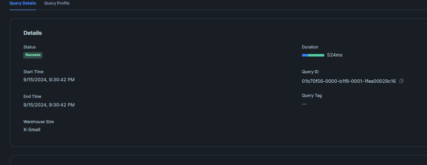

# Dublin Transportation Data Warehouse 
## Developed by: Edmundo Aarón Llaza Miranda

To create the database I worked with "SnowFlake" [app.snowflake.com](https://app.snowflake.com/), the continue code is the creation of the Database and the schema with I'll work to the ingest of the data.

~~~
create database PublicTransportDublin
use PublicTransportDublin
create schema Ingest
~~~

### Luas Passenger Numbers
Then was the creation of the tables that would be ingested with the data from the csv
~~~
CREATE OR REPLACE TABLE LUASPASSENGERS (
    statistic STRING,
    statistic_label STRING,
    year INT,
    month STRING,
    value FLOAT
);
~~~

### Dublin Bus Passenger Numbers
And executed the program [LuasPassenger.py](LuasPassenger.py) wich use all columns less TLIST, C01885V02316 and unit, because there year contains the same value with TLIST and month with C01885V02316 are the same value in diferent expressions and UNIT just is the definition of the next column VALUE.

I made the same with the csv of the buss passengers, here I created the table with the columns that I think are nessesary:
~~~
CREATE OR REPLACE TABLE BUSSPASSENGER (
    statistic_label STRING,
    year INT,
    month STRING,
    value FLOAT
);
~~~
Continue with the execution of the program [BussPassenger.py](BussPassenger.py) where I used the value of all columns less UNIT.

### Weather Data - Met  Éireann
With the weather data I had to made a fix with the headers because the column ind it's repeating the name so I add a number to differenciate in the others having the headers like: *"date,ind,rain,ind1,maxt,ind2,mint,gmin,soil"*  and deleting the first 13 rows because it was just a leyend of the data, the loaded of the data was with the program [WeatherData.py](WeatherData.py).

~~~
CREATE OR REPLACE TABLE WEATHER_DATA (
    date DATE,
    ind INT,
    rain FLOAT,
    ind1 INT,
    maxt FLOAT,
    ind2 INT,
    mint FLOAT,
    gmin FLOAT,
    soil FLOAT
);
~~~

### Dublin Bikes
To get access to the data from Dublinbike I enter to the link [Dublin Bikes](https://data.smartdublin.ie/dublinbikes-api/bikes/openapi.json), the pipeline is the program [DublinBikes.py](DublinBikes.py) and consume the endpoint /{system_id}/historical/station.csv because the other /{system_id}/historical/station wont work like it should be.
~~~
CREATE OR REPLACE TABLE DUBLINBIKES (
    system_id STRING,
    last_reported TIMESTAMP_NTZ,
    station_id STRING,
    num_bikes_available INT,
    num_docks_available INT,
    is_installed BOOLEAN,
    is_renting BOOLEAN,
    is_returning BOOLEAN,
    name STRING,
    short_name STRING,
    address STRING,
    lat FLOAT,
    lon FLOAT,
    region_id STRING,
    capacity INT
);
~~~
Here was worked with the dates "2024-06-15T00:00:00" and "2024-09-15T00:00:00" by the instructions from the document.

### Cycle Counts
For the last document I loaded manually because it contains massive data to work, here I just used the program [CycleCount.py](CycleCounts.py) to clean the name from the headers wich had special characters like coma or parentheses and its saved with the name [CycleCountsClean.csv](CycleCountsClean.csv).

## Transform Data
Now I'll transform some data to could work with them and could relate with the others, in my case I'll use the table CycleCount like my facts table because it have more cuantity of data.

### Cleaning LUASPASSENGERS and BUSSPASSENGERS
In this table I had the enought data to could work but the date isn't clear so I cast the columns year and month and add a column DDate that it's the join of both columns.

~~~
ALTER TABLE LUASPASSENGERS ADD COLUMN DDate DATE;
UPDATE LUASPASSENGERS
SET DDate = DATE_FROM_PARTS(
    YEAR,
    CASE 
        WHEN MONTH = 'January' THEN 1
        WHEN MONTH = 'February' THEN 2
        WHEN MONTH = 'March' THEN 3
        WHEN MONTH = 'April' THEN 4
        WHEN MONTH = 'May' THEN 5
        WHEN MONTH = 'June' THEN 6
        WHEN MONTH = 'July' THEN 7
        WHEN MONTH = 'August' THEN 8
        WHEN MONTH = 'September' THEN 9
        WHEN MONTH = 'October' THEN 10
        WHEN MONTH = 'November' THEN 11
        WHEN MONTH = 'December' THEN 12
        ELSE NULL
    END,
    1
);
~~~

As the same with the table BUSSPASSENGER wich columns year and month will need the same transformation the code is the same just change the variable from the table.
~~~
ALTER TABLE BUSSPASSENGER ADD COLUMN DDate DATE;
UPDATE BUSSPASSENGER
SET DDate = DATE_FROM_PARTS(
    YEAR,
    CASE 
        WHEN MONTH = 'January' THEN 1
        WHEN MONTH = 'February' THEN 2
        WHEN MONTH = 'March' THEN 3
        WHEN MONTH = 'April' THEN 4
        WHEN MONTH = 'May' THEN 5
        WHEN MONTH = 'June' THEN 6
        WHEN MONTH = 'July' THEN 7
        WHEN MONTH = 'August' THEN 8
        WHEN MONTH = 'September' THEN 9
        WHEN MONTH = 'October' THEN 10
        WHEN MONTH = 'November' THEN 11
        WHEN MONTH = 'December' THEN 12
        ELSE NULL
    END,
    1
);
~~~

### Cleaning WeatherData
In this case we have a lot of data since 1948 and in the document said that we have to use data from 2023 so I'll add a conditional "between" and fill the rows where have null 
~~~
UPDATE WEATHER_DATA
SET 
    ind = COALESCE(ind, 0),
    ind1 = COALESCE(ind1, 0),
    maxt = COALESCE(maxt, 0),
    ind2 = COALESCE(ind2, 0),
    mint = COALESCE(mint, 0),
    gmin = COALESCE(gmin, 0),
    soil = COALESCE(soil, 0);
~~~

### Cleaning Dublin Bikes
Unfortunately, the data here cannot be related to the others because the document data starts from the day "2024-06-15 00:05:00.000" and the other data sources have the last day at approximately 2024-05-01. Any way I add the column of Date to cast de timestamp to date.
~~~
ALTER TABLE DUBLINBIKES ADD COLUMN DDate DATE;
UPDATE DUBLINBIKES
SET DDate = to_date(last_reported);
~~~

### Cleaning CycleCounts
In this part I add a column called DDate and set the date that is on the first column "Time" just in the format YYYY-MM-DD, and changed the value of the rows where have null in the values with the next script.
~~~
UPDATE cyclecount
SET 
    charleville_mall_unable_to_reinstall_repaired_counter_due_to_roadworks_23082023 = COALESCE(charleville_mall_unable_to_reinstall_repaired_counter_due_to_roadworks_23082023, 0),
    charleville_mall_unable_to_reinstall_repaired_counter_due_to_roadworks_23082023_north_cyclist = COALESCE(charleville_mall_unable_to_reinstall_repaired_counter_due_to_roadworks_23082023_north_cyclist, 0),
    charleville_mall_unable_to_reinstall_repaired_counter_due_to_roadworks_23082023_south_cyclist = COALESCE(charleville_mall_unable_to_reinstall_repaired_counter_due_to_roadworks_23082023_south_cyclist, 0),
    clontarf__james_larkin_rd = COALESCE(clontarf__james_larkin_rd, 0),
    clontarf__james_larkin_rd_cyclist_west = COALESCE(clontarf__james_larkin_rd_cyclist_west, 0),
    clontarf__james_larkin_rd_cyclist_east = COALESCE(clontarf__james_larkin_rd_cyclist_east, 0),
    clontarf__pebble_beach_carpark = COALESCE(clontarf__pebble_beach_carpark, 0),
    clontarf__pebble_beach_carpark_cyclist_west = COALESCE(clontarf__pebble_beach_carpark_cyclist_west, 0),
    clontarf__pebble_beach_carpark_cyclist_east = COALESCE(clontarf__pebble_beach_carpark_cyclist_east, 0),
    drumcondra_cyclists_inbound_not_on_site__roadworks_cyclist = COALESCE(drumcondra_cyclists_inbound_not_on_site__roadworks_cyclist, 0),
    drumcondra_cyclists_inbound_not_on_site__roadworks_cyclist_west = COALESCE(drumcondra_cyclists_inbound_not_on_site__roadworks_cyclist_west, 0),
    drumcondra_cyclists_inbound_not_on_site__roadworks_cyclist_east = COALESCE(drumcondra_cyclists_inbound_not_on_site__roadworks_cyclist_east, 0),
    drumcondra_cyclists_outbound_not_on_site__roadworks = COALESCE(drumcondra_cyclists_outbound_not_on_site__roadworks, 0),
    drumcondra_cyclists_outbound_not_on_site__roadworks_cyclist_east = COALESCE(drumcondra_cyclists_outbound_not_on_site__roadworks_cyclist_east, 0),
    drumcondra_cyclists_outbound_not_on_site__roadworks_cyclist_west = COALESCE(drumcondra_cyclists_outbound_not_on_site__roadworks_cyclist_west, 0),
    griffith_avenue_clare_rd_side = COALESCE(griffith_avenue_clare_rd_side, 0),
    griffith_avenue_clare_rd_side_cyclist_south = COALESCE(griffith_avenue_clare_rd_side_cyclist_south, 0),
    griffith_avenue_clare_rd_side_cyclist_north = COALESCE(griffith_avenue_clare_rd_side_cyclist_north, 0),
    griffith_avenue_lane_side = COALESCE(griffith_avenue_lane_side, 0),
    griffith_avenue_lane_side_cyclist_south = COALESCE(griffith_avenue_lane_side_cyclist_south, 0),
    griffith_avenue_lane_side_cyclist_north = COALESCE(griffith_avenue_lane_side_cyclist_north, 0),
    grove_road_totem = COALESCE(grove_road_totem, 0),
    grove_road_totem_out = COALESCE(grove_road_totem_out, 0),
    grove_road_totem_in = COALESCE(grove_road_totem_in, 0),
    north_strand_rd_nb_counter_removed_for_roadworks_cyclist = COALESCE(north_strand_rd_nb_counter_removed_for_roadworks_cyclist, 0),
    richmond_street_inbound = COALESCE(richmond_street_inbound, 0),
    richmond_street_inbound_cyclist_south = COALESCE(richmond_street_inbound_cyclist_south, 0),
    richmond_street_inbound_cyclist_north = COALESCE(richmond_street_inbound_cyclist_north, 0),
    richmond_street_outbound = COALESCE(richmond_street_outbound, 0),
    richmond_street_outbound_cyclist_north = COALESCE(richmond_street_outbound_cyclist_north, 0),
    richmond_street_outbound_cyclist_south = COALESCE(richmond_street_outbound_cyclist_south, 0);
~~~
Finally I created a StoreProcedure to execute all this querys.

**STORED PROCEDURE update_luaspassengers_date()**

To update and add DDate in LUASPASSENGERS
~~~
CREATE OR REPLACE PROCEDURE update_luaspassengers_date()
RETURNS STRING
LANGUAGE JAVASCRIPT
EXECUTE AS CALLER
AS
$$
try {
    // Agregar la columna DDate
    var addColumnStmt = snowflake.createStatement({
        sqlText: `ALTER TABLE LUASPASSENGERS ADD COLUMN IF NOT EXISTS DDate DATE`
    });
    addColumnStmt.execute();

    // Actualizar la columna DDate con los valores calculados
    var updateStmt = snowflake.createStatement({
        sqlText: `
            UPDATE LUASPASSENGERS
            SET DDate = DATE_FROM_PARTS(
                YEAR,
                CASE 
                    WHEN MONTH = 'January' THEN 1
                    WHEN MONTH = 'February' THEN 2
                    WHEN MONTH = 'March' THEN 3
                    WHEN MONTH = 'April' THEN 4
                    WHEN MONTH = 'May' THEN 5
                    WHEN MONTH = 'June' THEN 6
                    WHEN MONTH = 'July' THEN 7
                    WHEN MONTH = 'August' THEN 8
                    WHEN MONTH = 'September' THEN 9
                    WHEN MONTH = 'October' THEN 10
                    WHEN MONTH = 'November' THEN 11
                    WHEN MONTH = 'December' THEN 12
                    ELSE NULL
                END,
                1
            )
        `
    });
    updateStmt.execute();

    return 'Procedure executed successfully';
} catch (err) {
    return 'Failed to execute procedure: ' + err;
}
$$;
~~~
**STORED PROCEDURE update_buspassenger_date()**

The same with BUSSPASSENGER
~~~
CREATE OR REPLACE PROCEDURE update_buspassenger_date()
RETURNS STRING
LANGUAGE JAVASCRIPT
EXECUTE AS CALLER
AS
$$
try {
    // Agregar la columna DDate
    var addColumnStmt = snowflake.createStatement({
        sqlText: `ALTER TABLE BUSSPASSENGER ADD COLUMN IF NOT EXISTS DDate DATE`
    });
    addColumnStmt.execute();

    // Actualizar la columna DDate con los valores calculados
    var updateStmt = snowflake.createStatement({
        sqlText: `
            UPDATE BUSSPASSENGER
            SET DDate = DATE_FROM_PARTS(
                YEAR,
                CASE 
                    WHEN MONTH = 'January' THEN 1
                    WHEN MONTH = 'February' THEN 2
                    WHEN MONTH = 'March' THEN 3
                    WHEN MONTH = 'April' THEN 4
                    WHEN MONTH = 'May' THEN 5
                    WHEN MONTH = 'June' THEN 6
                    WHEN MONTH = 'July' THEN 7
                    WHEN MONTH = 'August' THEN 8
                    WHEN MONTH = 'September' THEN 9
                    WHEN MONTH = 'October' THEN 10
                    WHEN MONTH = 'November' THEN 11
                    WHEN MONTH = 'December' THEN 12
                    ELSE NULL
                END,
                1
            )
        `
    });
    updateStmt.execute();

    return 'Procedure executed successfully';
} catch (err) {
    return 'Failed to execute procedure: ' + err;
}
$$;
~~~
**STORED PROCEDURE update_weather_data()**

Now to replace the null values in WEATHER_DATA
~~~
CREATE OR REPLACE PROCEDURE update_weather_data()
RETURNS STRING
LANGUAGE JAVASCRIPT
EXECUTE AS CALLER
AS
$$
try {
    // Actualizar la tabla WEATHER_DATA para reemplazar NULL con 0
    var updateStmt = snowflake.createStatement({
        sqlText: `
            UPDATE WEATHER_DATA
            SET 
                ind = COALESCE(ind, 0),
                ind1 = COALESCE(ind1, 0),
                maxt = COALESCE(maxt, 0),
                ind2 = COALESCE(ind2, 0),
                mint = COALESCE(mint, 0),
                gmin = COALESCE(gmin, 0),
                soil = COALESCE(soil, 0)
        `
    });
    updateStmt.execute();

    return 'Procedure executed successfully';
} catch (err) {
    return 'Failed to execute procedure: ' + err;
}
$$;
~~~

**STORED PROCEDURE update_dublinbikes_date()**

Here is to add a column of date in DUBLINBIKES and set the date.
~~~
CREATE OR REPLACE PROCEDURE update_dublinbikes_date()
RETURNS STRING
LANGUAGE JAVASCRIPT
EXECUTE AS CALLER
AS
$$
try {
    // Agregar la columna DDate
    var addColumnStmt = snowflake.createStatement({
        sqlText: `ALTER TABLE DUBLINBIKES ADD COLUMN IF NOT EXISTS DDate DATE`
    });
    addColumnStmt.execute();

    // Actualizar la columna DDate con los valores de last_reported
    var updateStmt = snowflake.createStatement({
        sqlText: `
            UPDATE DUBLINBIKES
            SET DDate = TO_DATE(last_reported)
        `
    });
    updateStmt.execute();

    return 'Procedure executed successfully';
} catch (err) {
    return 'Failed to execute procedure: ' + err;
}
$$;
~~~

**Stored PROCEDURE update_cyclecount_data()**

This part it's to add the column of ddata and replace the null values
~~~
CREATE OR REPLACE PROCEDURE update_cyclecount_data()
RETURNS STRING
LANGUAGE JAVASCRIPT
EXECUTE AS CALLER
AS
$$
try {
    // Agregar la columna DDate
    var addColumnStmt = snowflake.createStatement({
        sqlText: `ALTER TABLE CYCLECOUNT ADD COLUMN IF NOT EXISTS DDate DATE`
    });
    addColumnStmt.execute();

    // Actualizar la columna DDate con los valores de Time
    var updateDateStmt = snowflake.createStatement({
        sqlText: `
            UPDATE CYCLECOUNT
            SET DDate = TO_DATE(Time, 'DD-MM-YYYY HH24:MI:SS')
        `
    });
    updateDateStmt.execute();

    // Reemplazar valores NULL con 0 en las columnas especificadas
    var updateNullsStmt = snowflake.createStatement({
        sqlText: `
            UPDATE CYCLECOUNT
            SET 
                charleville_mall_unable_to_reinstall_repaired_counter_due_to_roadworks_23082023 = COALESCE(charleville_mall_unable_to_reinstall_repaired_counter_due_to_roadworks_23082023, 0),
                charleville_mall_unable_to_reinstall_repaired_counter_due_to_roadworks_23082023_north_cyclist = COALESCE(charleville_mall_unable_to_reinstall_repaired_counter_due_to_roadworks_23082023_north_cyclist, 0),
                charleville_mall_unable_to_reinstall_repaired_counter_due_to_roadworks_23082023_south_cyclist = COALESCE(charleville_mall_unable_to_reinstall_repaired_counter_due_to_roadworks_23082023_south_cyclist, 0),
                clontarf__james_larkin_rd = COALESCE(clontarf__james_larkin_rd, 0),
                clontarf__james_larkin_rd_cyclist_west = COALESCE(clontarf__james_larkin_rd_cyclist_west, 0),
                clontarf__james_larkin_rd_cyclist_east = COALESCE(clontarf__james_larkin_rd_cyclist_east, 0),
                clontarf__pebble_beach_carpark = COALESCE(clontarf__pebble_beach_carpark, 0),
                clontarf__pebble_beach_carpark_cyclist_west = COALESCE(clontarf__pebble_beach_carpark_cyclist_west, 0),
                clontarf__pebble_beach_carpark_cyclist_east = COALESCE(clontarf__pebble_beach_carpark_cyclist_east, 0),
                drumcondra_cyclists_inbound_not_on_site__roadworks_cyclist = COALESCE(drumcondra_cyclists_inbound_not_on_site__roadworks_cyclist, 0),
                drumcondra_cyclists_inbound_not_on_site__roadworks_cyclist_west = COALESCE(drumcondra_cyclists_inbound_not_on_site__roadworks_cyclist_west, 0),
                drumcondra_cyclists_inbound_not_on_site__roadworks_cyclist_east = COALESCE(drumcondra_cyclists_inbound_not_on_site__roadworks_cyclist_east, 0),
                drumcondra_cyclists_outbound_not_on_site__roadworks = COALESCE(drumcondra_cyclists_outbound_not_on_site__roadworks, 0),
                drumcondra_cyclists_outbound_not_on_site__roadworks_cyclist_east = COALESCE(drumcondra_cyclists_outbound_not_on_site__roadworks_cyclist_east, 0),
                drumcondra_cyclists_outbound_not_on_site__roadworks_cyclist_west = COALESCE(drumcondra_cyclists_outbound_not_on_site__roadworks_cyclist_west, 0),
                griffith_avenue_clare_rd_side = COALESCE(griffith_avenue_clare_rd_side, 0),
                griffith_avenue_clare_rd_side_cyclist_south = COALESCE(griffith_avenue_clare_rd_side_cyclist_south, 0),
                griffith_avenue_clare_rd_side_cyclist_north = COALESCE(griffith_avenue_clare_rd_side_cyclist_north, 0),
                griffith_avenue_lane_side = COALESCE(griffith_avenue_lane_side, 0),
                griffith_avenue_lane_side_cyclist_south = COALESCE(griffith_avenue_lane_side_cyclist_south, 0),
                griffith_avenue_lane_side_cyclist_north = COALESCE(griffith_avenue_lane_side_cyclist_north, 0),
                grove_road_totem = COALESCE(grove_road_totem, 0),
                grove_road_totem_out = COALESCE(grove_road_totem_out, 0),
                grove_road_totem_in = COALESCE(grove_road_totem_in, 0),
                north_strand_rd_nb_counter_removed_for_roadworks_cyclist = COALESCE(north_strand_rd_nb_counter_removed_for_roadworks_cyclist, 0),
                richmond_street_inbound = COALESCE(richmond_street_inbound, 0),
                richmond_street_inbound_cyclist_south = COALESCE(richmond_street_inbound_cyclist_south, 0),
                richmond_street_inbound_cyclist_north = COALESCE(richmond_street_inbound_cyclist_north, 0),
                richmond_street_outbound = COALESCE(richmond_street_outbound, 0),
                richmond_street_outbound_cyclist_north = COALESCE(richmond_street_outbound_cyclist_north, 0),
                richmond_street_outbound_cyclist_south = COALESCE(richmond_street_outbound_cyclist_south, 0)
        `
    });
    updateNullsStmt.execute();

    return 'Procedure executed successfully';
} catch (err) {
    return 'Failed to execute procedure: ' + err;
}
$$;
~~~

## Load
Finally I'll fill a DataWarehouse with these data collected in the next script:
~~~
CREATE OR REPLACE TABLE CombinedData AS
SELECT 
    WD.DATE,
    LP.STATISTIC AS LP_STATISTIC,
    LP.STATISTIC_LABEL AS LP_STATISTIC_LABEL,
    LP.VALUE AS LP_VALUE,
    BP.STATISTIC_LABEL AS BP_STATISTIC_LABEL,
    BP.VALUE AS BP_VALUE,
    WD.IND,
    WD.RAIN,
    WD.IND1,
    WD.MAXT,
    WD.IND2,
    WD.MINT,
    WD.GMIN,
    WD.SOIL,
    CC.*
FROM CYCLECOUNT AS CC 
LEFT JOIN WEATHER_DATA AS WD ON WD.DATE = CC.DDATE
LEFT JOIN BUSSPASSENGER AS BP ON BP.DDATE = WD.DATE
LEFT JOIN LUASPASSENGERS AS LP ON LP.DDATE = WD.DATE;
~~~

Now with this I can create a DataWarehouse actually I'll create it as a schema: 
~~~
CREATE SCHEMA DW
~~~
and fill with:
~~~
CREATE OR REPLACE TABLE DW.DUBLINPUBTrans AS
SELECT 
    WD.DATE,
    LP.STATISTIC AS LP_STATISTIC,
    LP.STATISTIC_LABEL AS LP_STATISTIC_LABEL,
    LP.VALUE AS LP_VALUE,
    BP.STATISTIC_LABEL AS BP_STATISTIC_LABEL,
    BP.VALUE AS BP_VALUE,
    WD.IND,
    WD.RAIN,
    WD.IND1,
    WD.MAXT,
    WD.IND2,
    WD.MINT,
    WD.GMIN,
    WD.SOIL,
    CC.*
FROM CYCLECOUNT AS CC 
LEFT JOIN WEATHER_DATA AS WD ON WD.DATE = CC.DDATE
LEFT JOIN BUSSPASSENGER AS BP ON BP.DDATE = WD.DATE
LEFT JOIN LUASPASSENGERS AS LP ON LP.DDATE = WD.DATE;
~~~
The result is saved in the document [2024-09-15 9_16pm.csv](<2024-09-15 9_16pm.csv>)

The consume of the Query is on the next images.

